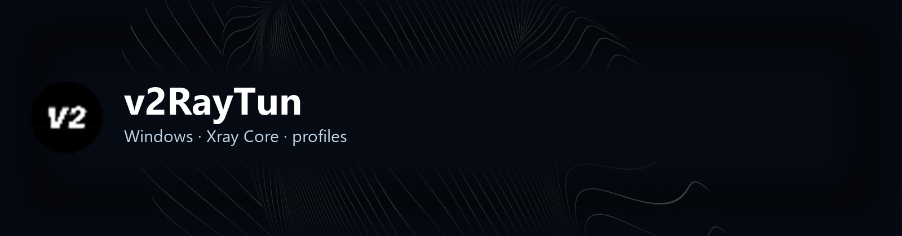

<!-- seo-unique:v2raytun:3181747d6f -->

  

  

  <b>v2RayTun — клиент для профилей подключений на базе Xray Core.</b> 
  Xray-core · подписка · TUN · Windows x64 · <code>v2raytun_windows.exe</code>

  <a href="./releases/latest"><b>⬇ Releases — скачать v2raytun_windows.zip</b></a>

 

> **v2RayTun не продаёт VPN.** Это открытый **клиент**: вы добавляете свой профиль / подписку.  
> Официальный проект: [LXST-CODE/v2RayTun](https://github.com/LXST-CODE/v2RayTun) · сайт [v2raytun.com](https://v2raytun.com/)

 

  
  &nbsp;
  

 

## Быстрый старт

1. Откройте **[Releases → Latest](./releases/latest)**.
2. Скачайте **`v2raytun_windows.zip`**.
3. Распакуйте и запустите **`v2raytun_windows.exe`** (для TUN лучше от администратора).
4. Если SmartScreen: **Подробнее → Выполнить в любом случае**.
5. Добавьте подписку или профиль → выберите сервер → подключитесь.
6. При необходимости проверьте настройки TUN / маршрутизации в клиенте.

 

## Что умеет v2RayTun

| | |
| :--- | :--- |
| **Xray Core** | Современные протоколы и профили подключений |
| **Подписка** | Свой ключ или ссылка — сервера не продаются |
| **TUN** | Системный туннель для всего трафика |
| **Windows x64** | Этот пак: **`v2raytun_windows.zip`** → **`v2raytun_windows.exe`** |
| **Кроссплатформа** | Windows · Android · iOS · macOS · Linux (upstream) |
| **Исходники** | [LXST-CODE/v2RayTun](https://github.com/LXST-CODE/v2RayTun) |

 

## Требования

| | |
| :--- | :--- |
| **ОС** | Windows 10 / 11 (64-bit) |
| **Права** | Администратор для TUN |
| **Ключ** | Своя подписка — в комплекте её нет |

 

## English

**v2RayTun** is a **client**, not a VPN provider. Add your own subscription / profile.

1. **[Releases → Latest](./releases/latest)** → download **`v2raytun_windows.zip`**
2. Extract and run **`v2raytun_windows.exe`**
3. SmartScreen: More info → Run anyway
4. Add subscription → connect (TUN)

Official upstream: [LXST-CODE/v2RayTun](https://github.com/LXST-CODE/v2RayTun)

 

## Об этом репозитории

Windows-сборка для GitHub Releases. Баги и обновления клиента — в [upstream](https://github.com/LXST-CODE/v2RayTun/issues).  
Этот репозиторий **не** является официальным аккаунтом LXST-CODE.

 

  v2raytun · #proxy-client #windows #skachat #besplatno #subscription

 

> [!NOTE]
> Подробная инструкция: **[DOWNLOAD.md](./DOWNLOAD.md)** · файл **`v2raytun.rar`**

<!-- id:e2f2eeac2043 -->
